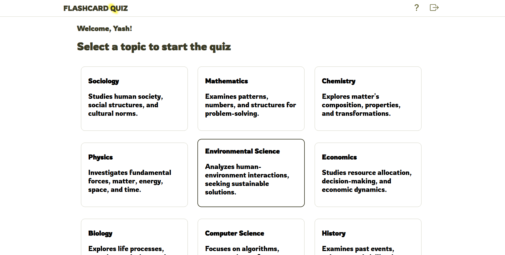

Here’s an updated and more polished version of your README file for the **Quiz App** with placeholders for screenshots. This version adds more structure, emphasizes key features, and includes a callout for your screenshots.

---

# Quiz App

## Introduction

The **Quiz App** is an interactive web application designed to enhance your learning experience with a variety of topics. Whether you're preparing for exams or just testing your knowledge, this app offers a fun and engaging quiz-taking process. Featuring multiple-choice questions, a built-in timer, and animations, it helps you improve your learning in a more enjoyable way. The app remembers your progress and provides a personalized experience by saving your name and quiz results.

You can also easily remove any names you've added at any time to maintain a clean user experience.

---

## Features

- **User Authentication**: Enter your name to start taking quizzes and keep track of your progress.
- **Multi-User System**: Add multiple names to create distinct accounts and track progress for each name separately.
- **Topic Selection**: Choose from various topics to begin the quiz and test your knowledge on different subjects.
- **Quiz Interface**: A smooth and user-friendly quiz interface that displays one question at a time with navigation buttons.
- **Answer Selection**: Select answers from multiple-choice options provided for each question.
- **Timer**: Each quiz is timed with a 10-minute countdown. Once the timer expires, only the correct answers from attempted questions are considered.
- **Blur Effect**: Once you complete the quiz, the interface is blurred, and your results are shown with smooth animations.
- **Quiz Retake**: You can retake quizzes as many times as you'd like for better practice.
- **Local Storage**: The app saves your data and quiz results using local storage, so your progress is always available.
- **User-Friendly Design**: Flashcard Quiz saves your names for easy sign-ins and a seamless experience.
- **Responsive UX/UI**: The app is designed with an attractive user interface that’s responsive for devices with widths above 300 pixels.

---

## Usage

1. **User Authentication**: Enter your name to create or access your personalized account.
2. **Topic Selection**: Choose a topic to begin your quiz.
3. **Quiz Interface**: Use the navigation buttons to move through questions one at a time.
4. **Answer Selection**: Pick the correct answer from multiple choices for each question.
5. **Timer**: Track the countdown to ensure you finish within the 10-minute limit.
6. **Quiz Completion**: Upon finishing, the quiz interface blurs, and your results are displayed.
7. **Retake Quiz**: If you wish, you can always retake quizzes to improve your score.

---

## Installation

Follow these steps to install and run the **Quiz App** locally:

1. Clone or download the repository from [GitHub](https://github.com/11Yashyadav/quiz-app).
2. Navigate to the project directory in your terminal.
3. Install the required dependencies by running:
   ```bash
   npm install
   ```
4. Start the development server with:
   ```bash
   npm run dev
   ```
5. Open the provided URL in your web browser to start using the application.

---

## Screenshots

Below are some screenshots showcasing the **Quiz App** in action:

  
_Choose your quiz topic from the available options._

  
_A user-friendly quiz interface where questions are displayed one at a time._

  
_Results are shown with smooth animations after completing the quiz._

---

## Conclusion

The **Quiz App** is designed to provide an interactive and personalized quiz experience. Whether you're a student or just someone who loves testing their knowledge, this app is a great way to practice and track your progress over time. Get started now and have fun learning!

Happy Coding!

---
